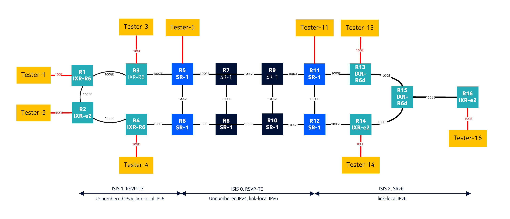

# SRv6 Lab: Access, Aggregation, and Core IP Network Simulation

This is a comprehensive lab simulating an access, aggregation, and core IP network using **SRv6 (Segment Routing over IPv6)** technology. The lab demonstrates L2 service interworking between an SRv6 domain in access ring 2 and a legacy RSVP domain in access ring 1, showcasing modern network evolution and service continuity.

## A. Network Architecture Overview

The lab consists of three main network layers:

### 1. **Access Ring 1: Legacy RSVP Domain**
- **R01-IXR** (IXR-R6): Access router with 10G/100G interfaces
- **R02-IXR** (IXR-e2): Access access router
- **R03-IXR** (IXR-R6): Access router with 10G/100G interfaces  
- **R04-IXR** (IXR-R6): Access with 10G/100G interfaces

### 2. **Core Network: SRv6 & RSVP Domain**
- **R05-SR** to **R12-SR** (SR-1): Core routers forming the backbone with both SRv6 and RSVP enabled
- **R05-SR** & **R06-SR**: ASBR (Autonomous System Border Routers) connecting RSVP to SRv6
- **R11-SR** & **R12-SR**: ASBR connecting SRv6 to SRv6 access ring

### 3. **Access Ring 2: SRv6 Domain**
- **R13-IXR** (IXR-R6d): SRv6 Access router with 100G QSFP28
- **R14-IXR** (IXR-e2): SRv6 Access router
- **R15-IXR** (IXR-R6d): SRv6 Access router with 100G QSFP28
- **R16-IXR** (IXR-e2): SRv6 Access router

### Key Features

- **Multi-Domain Interworking**: Seamless L2 service delivery between RSVP and SRv6 domains
- **Modern Network Evolution**: Smooth migration from legacy RSVP to modern SRv6
- **Comprehensive Testing**: Multiple test endpoints for service validation
- **Telemetry Integration**: Full observability with Prometheus, Grafana, and gNMI
- **Containerized Deployment**: Easy deployment using Containerlab using Nokia SR-SIM

## B. Lab Overview

### Service Validation
- L2 Epipe services between RSVP and SRv6 domains
- End-to-end connectivity verification
- Performance metrics collection

### High-Level Topology


### Technology Stack

- **Containerlab**: Network topology orchestration (0.69.3 or higher)
- **Nokia SROS**: Network operating system (25.7.R1 for SR-SIM support. If only vSIM is available, use 24.10.R1 or newer)
- **SRv6**: Segment Routing over IPv6 for modern packet forwarding
- **RSVP-TE**: Legacy traffic engineering protocol
- **EVPN**: multi-instance service layer for RSVP and SRv6 interworking
- **PW-switching**: PW switching for legacy deployment using a PW per domain stitched at the ASBR
- **gNMI**: Network configuration and telemetry
- **Prometheus + Grafana**: Monitoring and visualization

## C. Getting Started

### Prerequisites
- Docker and Containerlab installed
- Nokia SROS license files (see license section in topology file)
- Sufficient system resources for 16+ network nodes

### Deployment

1. **Clone the repository:**
```bash
git clone <repository-url>
cd srv6_lab
```

2. **Deploy the topology:**
```bash
containerlab deploy
```

3. **Verify deployment:**
```bash
containerlab inspect
```

### Management Access

All nodes are accessible via SSH on the following ports:
- **RSVP Access Ring**: 50101-50401 (R01-R04)
- **Core SRv6**: 50501-51201 (R05-R12)  
- **SRv6 Access Ring**: 51301-51601 (R13-R16)
- **Test Endpoints**: 172.20.20.120-128
- **Management Network**: 172.20.20.0/24

### Configuration

- **Node Configs**: Located in `./config/` directory
- **Telemetry Configs**: Located in `./tele-config/` directory
- **Topology File**: `topo.clab.yml` (main deployment file)

### Monitoring & Telemetry

The lab includes comprehensive monitoring capabilities:

- **Prometheus**: Metrics collection on port 9090
- **Grafana**: Visualization dashboard on port 3000
- **Consul**: Service discovery on port 8500
- **gNMI**: Network telemetry streaming

### Useful SRv6 commands
For classic SID
```c
/show router isis 1 segment-routing-v6 locator
/show router segment-routing-v6 local-sid
/show router isis segment-routing-v6 locator
```

For micro-SID (uSID or Next-CSID)
```c
/show router segment-routing-v6 micro-segment-locator 
/show router segment-routing-v6 micro-segment-local-sid
/show router isis 1 segment-routing-v6 micro-segment-locator 
```

```c
/show fwd-path-ext fpe 1
/show router route-table ipv6 2001:ac8:0:b::/64 
/show router tunnel-table ipv6 2001:ac8:0:b::/64
/show router tunnel-table ipv6 2001:ac8:0:b::/64 alternative 
/show router fib 1 ipv6 ip-prefix-prefix-length 2001:ac8:0:b::/64
/show router bgp routes 172.31.3.0/24 vpn-ipv4 detail
```

## C. Testing & Validation

### Test Endpoints
- **tester1-tester5**: RSVP domain connectivity testing
- **tester11, tester13, tester14, tester16**: SRv6 domain connectivity testing

### Detailed Port-Level Topology


## Service Interworking
The lab demonstrates **L2 service continuity** between:
- **Legacy RSVP domain** (Access Ring 1) 
- **Modern SRv6 domain** (Access Ring 2)

This showcases how service providers can evolve their networks while maintaining existing customer services.

### 1. Intra-domain RSVP-based ELINE: 
- epipe (T-LDP) R2-R3_2000
- Connectivity test between tester1 (IP 192.168.0.1, VLAN 10) and tester14 (IP 192.168.0.14, VLAN 10)
### 2. Inter-domain RSVP-based ELINE with PW-switching
- epipe (T-LDP) R1-R14_3000
- RSVP-based LSP/SDP per domain stitched at ASBR
- Includes PW-redundancy from R01 to both ASBR R05/R06
- Connectivity test between tester1 (IP 192.168.0.1, VLAN 10) and tester14 (IP 192.168.0.14, VLAN 10)
### 3. Intra-domain SRv6-based ELINE
- epipe (BGP-EVPN) R13-R16_VPWS-SRv6
- 
### 4. Inter-domain SRv6-based ELINE
- epipe (BGP-EVPN) R05-R16_VPWS-SRv6
- Connectivity between tester5 (IP 192.168.0.5) and tester16 (IP 192.168.0.16)

## Project Structure

```
srv6_lab/
├── topo.clab.yml              # Main topology file
├── topology/                   # Network diagrams
│   ├── Topology.png           # High-level topology
│   └── detailed_topology.png  # Port-level details
├── config/                     # Node configurations
├── tele-config/               # Telemetry configurations
├── clab-srv6/                 # Containerlab artifacts
└── README.md                  # This file
```

## Contributing

This lab is designed for educational and testing purposes. Feel free to modify configurations and experiment with different SRv6 scenarios.

## Additional Resources

- [Containerlab Documentation](https://containerlab.dev/)
- [Nokia SROS Documentation](https://documentation.nokia.com/)
- [Nokia SR-SIM](https://containerlab.dev/manual/kinds/sros/)
- [SRv6 Network Programming](https://datatracker.ietf.org/doc/rfc8986/)
- [BGP services over SRv6](https://datatracker.ietf.org/doc/rfc9252/)
- [Compressed SRv6](https://datatracker.ietf.org/doc/rfc9800/)

---

**Note**: Ensure you have valid Nokia SROS licenses before deploying this lab. The topology file references license files that must be present in the parent directory `../srv6_lab/`.
